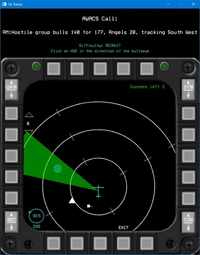
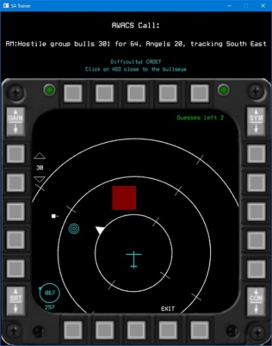

# Bullseye Trainer (Work in Progress)

### Inspiration:
Building a mental 3D map of the position of threat aircraft in the 3D space around you is vitally important as a fighter pilot. Learning to do that in a combat environment is very difficult so I built this training tool to allow virtual pilots to practice translating AWACS threat calls, with the information in the cockpit, into a picture of the threats in a safe controlled environment. This tool replicates the Horizontal Situation Display (HSD) and allows the user to combine the bullseye information in the HSD with the AWACS info in a safe environment. This set up allows a realistic training environment without the threats and time pressure of the actual in game environment.

I'm a founding member of the 72nd Ghosts. Find out more here [72nd Ghosts Homepage](http://72-ghosts.com/)

* A new re-factored version of this tool is currently in development *

### Techniques used/Learnings:
- Developed trigonometry based functions to determine the relative positions, distances of the various aircraft so they can be plotted on the cockpit display 
- OOP architecture and design principles - Inheritance, polymorphism, composition
- Integrating SDL, PLOG and the GoogleTest framework into the codebase
- Using Smartpointers, manging modular codebase and avoiding design issues (circular dependencies), state machines to control game state/flow/difficulty
- Use test cases to optimise how the data is stored and manipulated (game logic) before developing the UI

### Languages/Packages:
- Visual Studio 2022
- C++ 11 features (complied against C++20 standard)
- [PLOG](https://github.com/SergiusTheBest/plog)
- [SDL](https://www.libsdl.org/)
- [WinReg](https://github.com/GiovanniDicanio/WinReg)

### Images
Example of the lower level (recruit) where the task is to use the HSD information to estimate where the bullseye is in relation to your current heading. Correct responses are indicated with a green “pie slice”, incorrect with a “red pie” slice. The bullseye is only displayed once a correct guess has been made or 3 incorrect guesses.

Example of a higher level where the user is asked to use the bullseye information with the AWACS call to identify the location of the bogey. A red box is an incorrect guess, green is correct and as before the bogies are only shown once the correct guess or 3 incorrect guesses have been made.

Following screen shot show the setup screen where the level of difficulty and the logging levels can be set by the user. A detailed description of provided for each difficulty level to help the user understand what they need to do. A summary of this is displayed below the AWACS call in the main., “in game” screen as a reminder.

